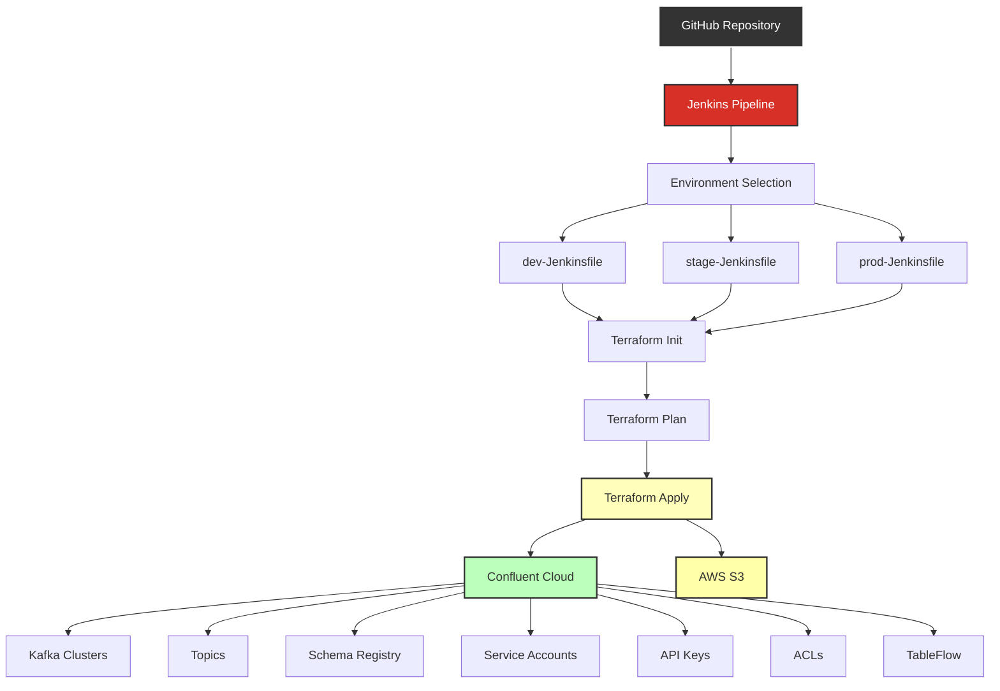

# Confluent Infrastructure as Code

This repository contains Terraform configurations for managing Confluent Cloud resources and infrastructure. The configurations are organized to provide a scalable and maintainable way to manage Confluent resources across different environments.

## Repository Structure

```
provisioning/
├── environments/          # Environment-specific configurations
├── schemas/              # Schema Registry schemas
├── resources_confluent_*.tf  # Confluent resource definitions
├── module_s3-confluent.tf    # S3 integration module
└── variables.tf          # Global variables
```

## Components

### Core Confluent Resources
- **Kafka Clusters**: Configuration for Confluent Cloud Kafka clusters
- **Topics**: Kafka topic definitions and configurations
- **Schema Registry**: Schema Registry setup and schema management
- **Service Accounts**: IAM service accounts for Confluent Cloud
- **API Keys**: API key management for Confluent Cloud services
- **ACLs**: Access Control Lists for Kafka resources

### Integrations
- **TableFlow**: Configuration for Confluent TableFlow
- **AWS Integration**: S3 integration and AWS secrets management
- **IAM**: Identity and Access Management configurations

## Prerequisites

- Terraform >= 1.0.0
- Confluent Cloud account
- AWS account (for S3 integration)
- Required environment variables:
  - `CONFLUENT_CLOUD_API_KEY`
  - `CONFLUENT_CLOUD_API_SECRET`

## Usage

1. Initialize Terraform:
   ```bash
   cd provisioning
   terraform init
   ```

2. Plan changes:
   ```bash
   terraform plan
   ```

3. Apply changes:
   ```bash
   terraform apply
   ```

## Jenkins Integration

This project is designed to work seamlessly with Jenkins for automated deployments. The repository includes Jenkins pipeline configurations for different environments.



### Jenkins Deployment Process

The deployment can be triggered in Jenkins by providing the GitHub repository path. Jenkins will automatically:
1. Clone the repository
2. Execute the environment-specific Jenkinsfile
3. Run Terraform commands to deploy the infrastructure
4. Handle environment-specific configurations

### Environment-Specific Jenkinsfiles

Each environment has its own Jenkinsfile with tailored deployment processes:

- **Development**: `environments/dev/dev-Jenkinsfile`
- **Staging**: `environments/stage/stage-Jenkinsfile`
- **Production**: `environments/prod/prod-Jenkinsfile`

### Setting up Jenkins Jobs

1. Create a new Jenkins pipeline job
2. Configure the job to use "Pipeline script from SCM"
3. Set the repository URL to this GitHub repository
4. Specify the appropriate Jenkinsfile path based on your target environment:
   - For dev: `provisioning/environments/dev/dev-Jenkinsfile`
   - For stage: `provisioning/environments/stage/stage-Jenkinsfile`
   - For prod: `provisioning/environments/prod/prod-Jenkinsfile`

### Jenkins Prerequisites

Ensure your Jenkins instance has:
- Terraform plugin installed
- Required credentials configured:
  - `CONFLUENT_CLOUD_API_KEY`
  - `CONFLUENT_CLOUD_API_SECRET`
  - AWS credentials (if using S3 integration)
- Git access to this repository

## Resource Management

### Kafka Topics
Topics are defined in `resources_confluent_topics.tf` and `resources_confluent_tableflow_topics.tf`. Each topic includes:
- Partition count
- Replication factor
- Retention period
- Cleanup policy

### Schema Registry
Schema Registry configurations are in `resources_confluent_schema_registry.tf`. It manages:
- Schema compatibility settings
- Schema versions
- Schema references

### Access Control
ACL configurations in `resources_confluent_acl.tf` define:
- Topic access permissions
- Consumer group permissions
- Cluster-level permissions

## Security

- API keys are managed through `resources_confluent_api_keys.tf`
- Service accounts are defined in `resources_confluent_service_accounts.tf`
- AWS secrets are managed in `resources_confluent_general_aws_secrets.tf`

## Contributing

1. Create a new branch for your changes
2. Make your changes
3. Test the changes in a development environment
4. Submit a pull request


## Documentation

Detailed documentation for each Confluent resource and data source can be found in the [docs](./docs) folder. Each file describes the schema, required and optional fields, and usage examples for the resource or data source.
